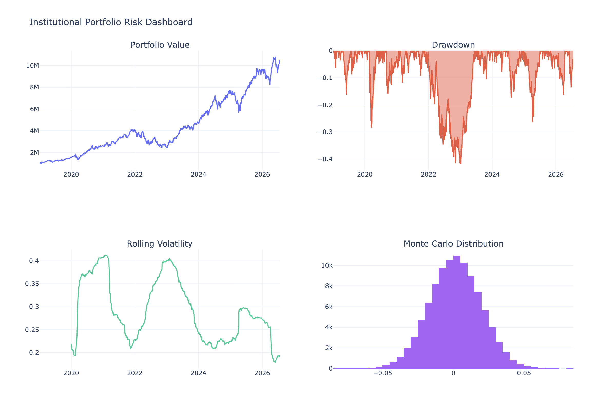
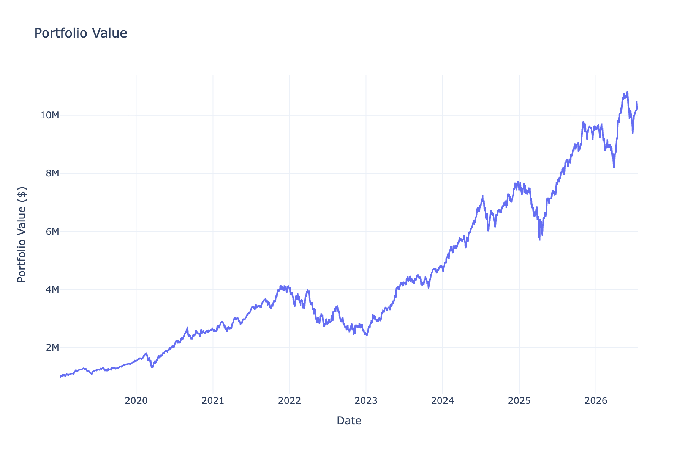
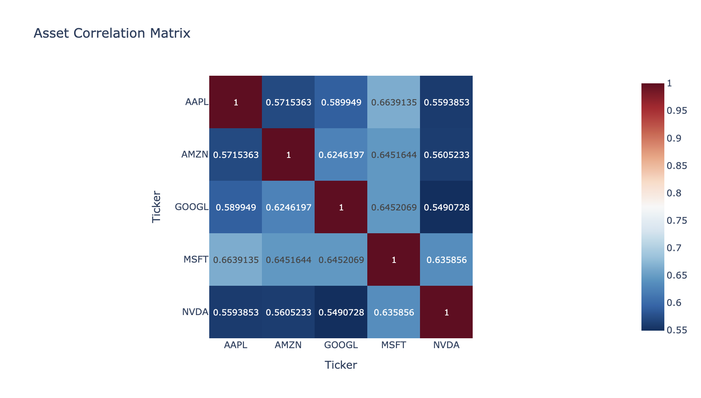
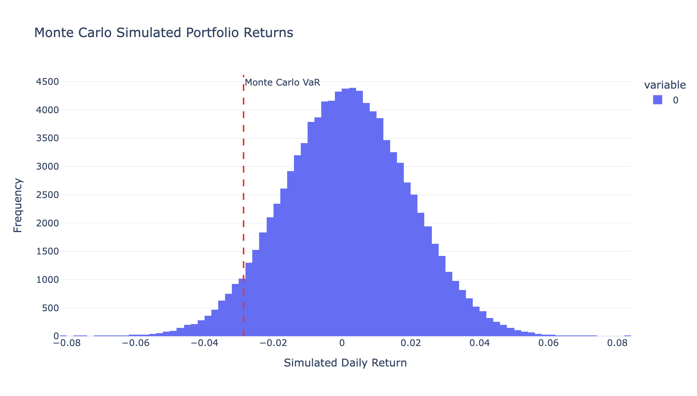
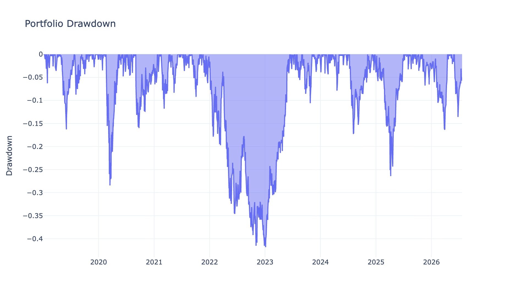
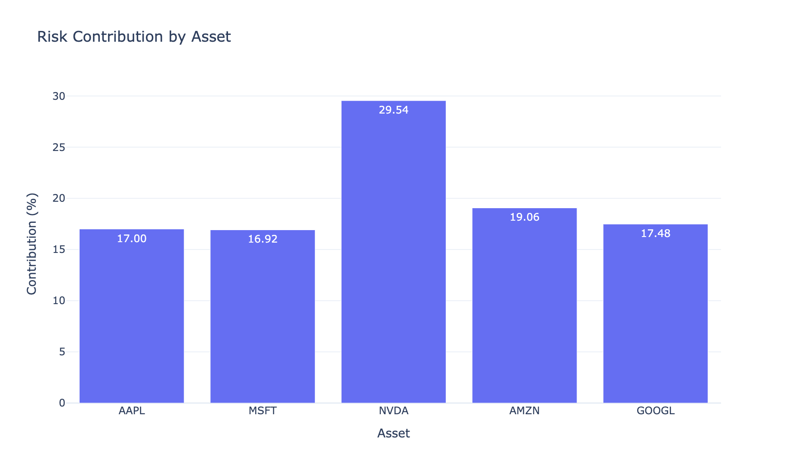

# 📊 Institutional Risk Management Dashboard

An institutional-style portfolio risk management dashboard built in Python using live market data. This project demonstrates the implementation of quantitative risk models, portfolio analytics, and interactive visualizations commonly used by banks, hedge funds, and asset managers.

---

## 📖 Project Overview

This project analyzes a multi-asset equity portfolio using historical market data from Yahoo Finance and applies professional risk management techniques to measure and visualize portfolio risk.

The dashboard calculates portfolio performance, Value-at-Risk (VaR), Expected Shortfall (CVaR), stress testing scenarios, and risk attribution while providing interactive visualizations using Plotly.

---

## 🚀 Features

- 📈 Portfolio Performance Analysis
- 📊 Historical Return Analysis
- 📉 Correlation & Covariance Matrices
- 💼 Portfolio Construction
- 📉 Maximum Drawdown Analysis
- 📊 Rolling Volatility
- ⚠ Historical Value-at-Risk (VaR)
- 📈 Parametric (Variance-Covariance) VaR
- 🎲 Monte Carlo Simulation VaR
- 📉 Expected Shortfall (Conditional VaR)
- 💥 Stress Testing & Scenario Analysis
- 📊 Portfolio Risk Attribution
- 📋 Executive Risk Dashboard
- 📁 CSV & Excel Report Export
- 📈 Interactive Plotly Visualizations

---

## 🛠 Technologies Used

- Python
- Google Colab
- Pandas
- NumPy
- SciPy
- Plotly
- yfinance
- openpyxl

---

## 📂 Project Structure

```text
institutional-risk-management-dashboard/

│── Institutional_Risk_Management_Dashboard.ipynb
│── README.md
│── requirements.txt
│── LICENSE
│── .gitignore

├── outputs/
│   ├── performance_metrics.csv
│   ├── portfolio_returns.csv
│   ├── risk_metrics.csv
│   ├── risk_contribution.csv
│   ├── stress_test_results.csv
│   └── risk_management_report.xlsx

└── screenshots/
```

---

## 📸 Project Screenshots

### Executive Dashboard



---

### Portfolio Value



---

### Correlation Heatmap



---

### Monte Carlo Simulation



---

### Drawdown Analysis



---

### Risk Contribution



---

## 📈 Quantitative Models Implemented

### Portfolio Performance Metrics

- Annual Return
- Annual Volatility
- Sharpe Ratio
- Sortino Ratio
- Calmar Ratio
- Maximum Drawdown

### Risk Metrics

- Historical Value-at-Risk (VaR)
- Parametric VaR
- Monte Carlo VaR
- Expected Shortfall (CVaR)

### Portfolio Analytics

- Correlation Matrix
- Covariance Matrix
- Rolling Volatility
- Portfolio Risk Attribution

### Stress Testing

- Market Crash Scenario
- Severe Market Crash
- Technology Sector Shock
- High Volatility Scenario

---

## 📊 Data Source

Market data is retrieved using:

- Yahoo Finance (`yfinance`)

Example assets analysed include:

- Apple (AAPL)
- Microsoft (MSFT)
- NVIDIA (NVDA)
- Amazon (AMZN)
- Alphabet (GOOGL)

---

## ▶️ How to Run

1. Clone this repository.

```bash
git clone https://github.com/lucbetpal/institutional-risk-management-dashboard.git
```

2. Install dependencies.

```bash
pip install -r requirements.txt
```

3. Open the notebook using Google Colab or Jupyter Notebook.

4. Run all cells sequentially.

---

## 📁 Outputs

The notebook exports:

- Portfolio Returns
- Performance Metrics
- Risk Metrics
- Risk Attribution
- Stress Testing Results
- Excel Risk Report
- Interactive Dashboard

---

## 💡 Real-World Applications

The techniques implemented in this project are widely used by:

- Investment Banks
- Hedge Funds
- Asset Managers
- Pension Funds
- Quantitative Research Teams
- Risk Management Departments

---

## 🔮 Future Improvements

Potential enhancements include:

- Portfolio Optimization (Mean-Variance)
- Black-Litterman Model
- Factor Risk Models
- GARCH Volatility Forecasting
- Credit Risk Analysis
- Live Market Dashboard
- Streamlit Web Application
- Bloomberg / Polygon API Integration

---

## 👤 Author

**Luc Pal**

Financial Economics & Accounting Student  
The University of Sydney

Interested in:

- Quantitative Finance
- Portfolio Management
- Risk Analytics
- Financial Engineering
- Python Development

---

## 📄 License

This project is licensed under the MIT License.
